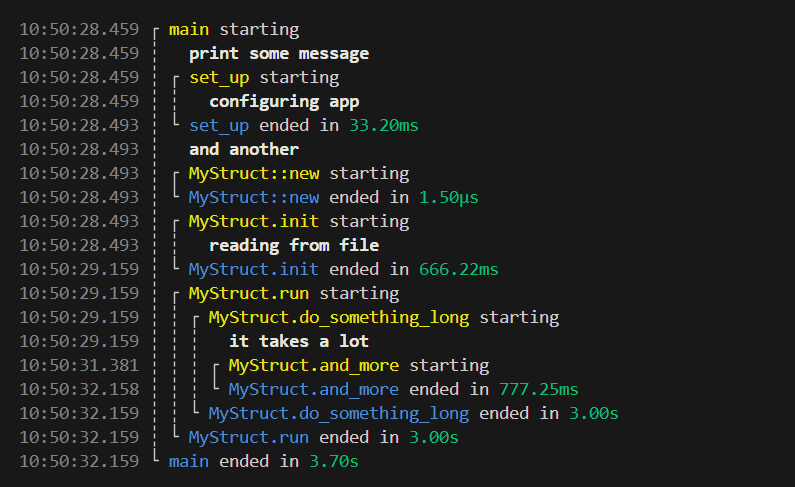

# Print run

### A procedural macro to trace function and module execution in Rust – with style.



**`print-run`** is a procedural macro for Rust that automatically prints messages when a function starts and finishes. It supports colorized output, timestamps, duration display, indentation for nested calls, and more.

It’s designed to be a lightweight and stylish debugging or tracing tool — ideal for building skeletons, quick experiments, or educational projects.

## ✨ Features

- Works with **functions**, **implementations**, and **inline modules**
- Automatically logs **entry and exit** of functions
- Draws **nested visual markers**
- Supports **async** programming
- Shows **execution duration**
- Includes **timestamps**
- **Colorized output**

## 📦 Installation

Install using Cargo:

```sh
cargo add print-run
```

Or add this crate to your dependencies in `Cargo.toml`:

```toml
[dependencies]
print-run = "0.1"
```

## 🚀 Getting Started

### Basic usage

```rust
use print_run_rs::print_run;

#[print_run]
fn my_function() {
    let x = 5;
    msg!("Some value: {}", x);
}

my_function();
```

Output:

```
my_function starting
 Some value: 5
my_function ended
```

### Using arguments

```rust
#[print_run(colored, duration, indent, supress_labels, timestamps)]
fn my_function() { ... }
```

Output (color not shown in markdown):

```
15:21:29.964 ┌ my_function
15:21:29.964 ┆  Some value: 5
15:21:29.964 └ my_function [9.50µs]
```

### For implementations

```rust
struct MyStruct;

#[print_run(indent)]
impl MyStruct {
    fn static_fn() { ... }
    fn instance_fn(&self) { ... }
}
```

Output:

```
┌ MyStruct::static_fn starting
└ MyStruct::static_fn ended
┌ MyStruct.instance_fn starting
└ MyStruct.instance_fn ended
```

### For entire modules

> [!WARNING]
> **Only inline modules are supported** due to Rust’s procedural macro limitations.

Every function inside the module will inherit the `#[print_run(...)]` attributes, including implementations. You can override them locally or exclude specific functions using `#[print_run(skip)]`.

The `msg!` macro is available in all instrumented functions.

```rust
#[print_run(colored, indent)]
mod my_module {
    fn something() {}
    fn another() {}

    #[print_run(duration)]
    fn overridden() {}

    #[print_run(skip)]
    fn not_printed() {}

    struct MyStruct;
    impl MyStruct {
        fn static_fn() {}
        fn method_1(&self) {}
        fn method_2(&self) {}
    }
}
```

### Global defaults

You can define defaults (once per crate) by placing `print_run_defaults` anywhere in the crate:

```rust
#[print_run_defaults(indent)]
```

> ℹ️ Note: Rust currently does not support custom crate-wide attributes like `#![print_run_defaults()]`.

## ⚙️ Configuration

The following arguments are supported by `#[print_run(...)]` and `#[print_run_defaults(...)]`:

| Argument         | Description                      | Notes                           |
| ---------------- | -------------------------------- | ------------------------------- |
| `colored`        | Enable ANSI color output         |                                 |
| `duration`       | Show function execution duration | Auto-selects units (s/ms/µs/ns) |
| `indent`         | Draw indented call hierarchy     |                                 |
| `skip`           | Skip the current function/module | Ignores all other arguments     |
| `supress_labels` | Hide `starting` / `ended` labels |                                 |
| `timestamps`     | Show timestamps in log output    | Format: `HH:mm:ss.sss`          |

All arguments can be combined but `skip` will override the rest.

## 📝 About `msg!`

The `msg!` macro works like `println!`, but:

* Adds indentation (if `indent` is enabled)
* Adds timestamps (if `timestamps` is enabled)
* Uses bold text (for better clarity)
* Automatically included in any function with `#[print_run]`
* Falls back to `println!` when used in skipped functions

## 📄 License

Licensed under [MIT](LICENSE).

## 🙌 Contributions

Contributions, suggestions, and issues are welcome! Feel free to fork the repo or open a PR.
